# ParkHop — every screen

Thirty-six captures: every screen, every tab, both halves of anything that scrolls, the
four sheets, and the empty states. Each has a **name in bold** — write your notes under
the one you mean and nothing else needs saying. "**K3b** rows are the wrong order" is
enough.

A name ending in **b** is the same screen scrolled to the bottom. A name ending in **e**
is that screen with nothing in it.

Captured from v2.12.2 on iPhone 16 Pro, iOS 26.4, located in Denver. ⚠ marks a gap I
already know about.

**Contents** — [Today](#today) · [Trips](#trips) · [Discover](#discover) ·
[Park](#park) · [Saved](#saved) · [Profile](#profile) · [Sheets](#sheets)

---

## Today

### **T1 — Today**

One recommendation, worked out fresh on every launch from where you are, today's forecast
at each candidate, and which parks you have not been to. Below it, the parks near that
one.

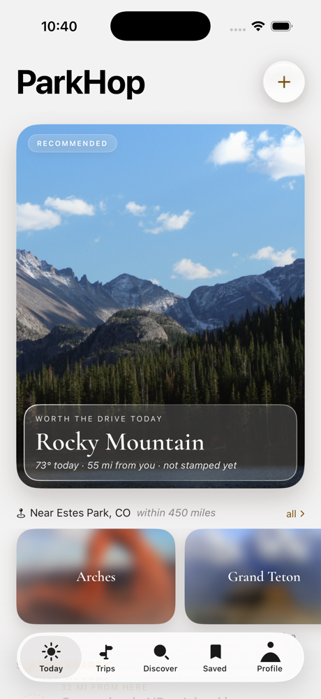

**Feedback:**
-

### **T1b — Today, lower**

The driving day and the stamps within reach.


**Feedback:**
-

---

## Trips

### **T2 — Trips**

On the books and behind you. The map is Apple Maps, monochrome; the disc removes a trip.

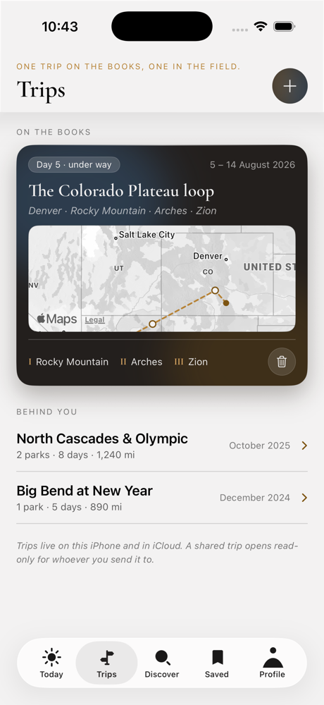

**Feedback:**
-

### **T2e — Trips, empty**

Before there is anything to show.

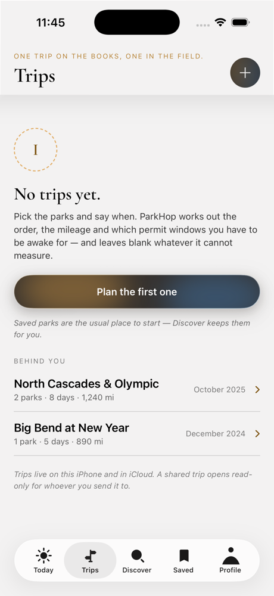

**Feedback:**
-

### **T3 — Trip · Route**

Parks in visiting order with the legs between them. The first row is the drive from where
you are standing, routed by OSRM; tapping any leg opens **X3**.


**Feedback:**
-

### **T3b — Trip · Route, lower**


**Feedback:**
-

### **T4 — Trip · Days**

Day by day. ⚠ Still the curated ten-day itinerary.

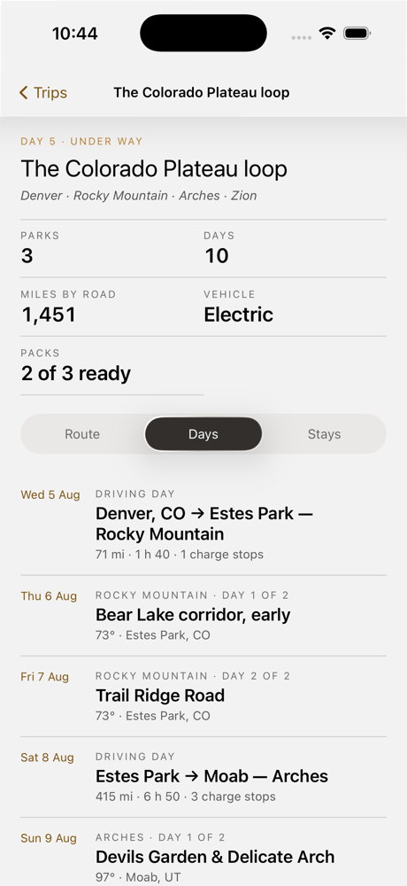

**Feedback:**
-

### **T5 — Trip · Stays**

Where you sleep each night. ⚠ Curated — Recreation.gov blocks non-browser callers, so
there is no availability for your own dates.


**Feedback:**
-

### **T6 — New trip · step 1**

Pick parks in visiting order. ⚠ This search still reads the eight curated parks rather
than the sixty-two on the phone.


**Feedback:**
-

### **T7 — New trip · step 2**

Dates, origin and vehicle.

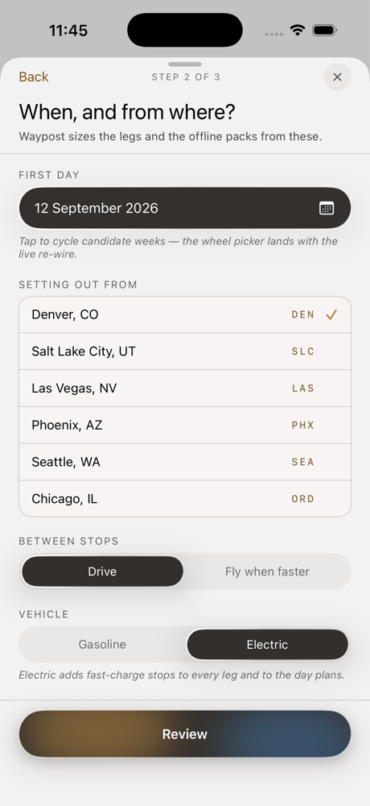

**Feedback:**
-

### **T8 — New trip · step 3**

The review, before it is composed.

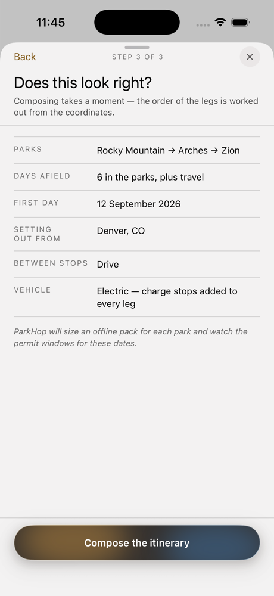

**Feedback:**
-

---

## Discover

### **D1 — Discover**

An empty field: the curated shelf, with the on-device brief above it.


**Feedback:**
-

### **D1b — Discover, lower**


**Feedback:**
-

### **D2 — Discover · suggestions**

Two letters in. States and parks match on the phone and appear on the keystroke; towns
come from Nominatim a moment later.


**Feedback:**
-

### **D3 — Discover · results**

A state search. The line under the chips says how many and from where — the on-device
list first, then Apple Maps, then OpenStreetMap filling in behind.


**Feedback:**
-

### **D3e — Discover · nothing found**

What a search with no answer says.

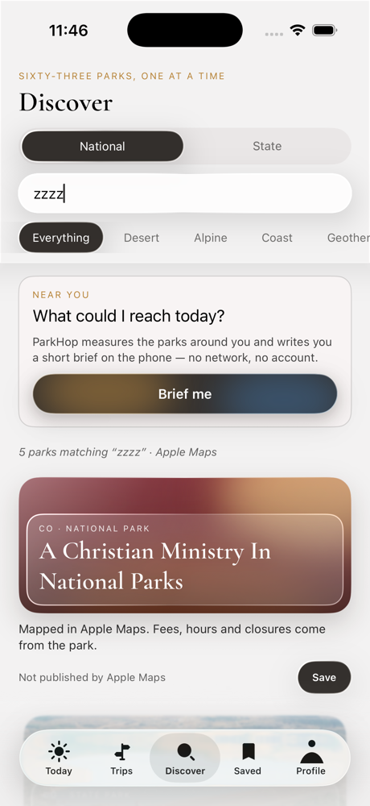

**Feedback:**
-

### **D4 — Discover · state parks**

The other catalogue: 470 units on the phone, plus what OpenStreetMap finds around the
place you typed.


**Feedback:**
-

---

## Park

Five segments of one screen, each with its lower half. **K6** is the same screen for a
park that is not one of the curated eight — worth comparing, because it shows what the
app says when a source is silent.

### **K1 — Park · Overview**

Reservations, alerts, gates and airports.

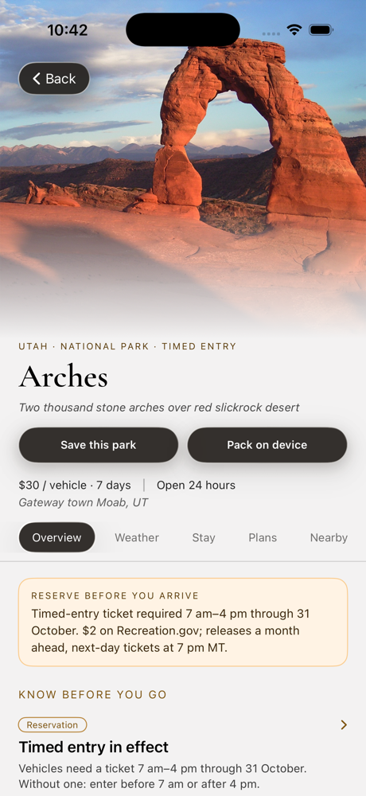

**Feedback:**
-

### **K1b — Park · Overview, lower**

Charging, fuel and shops, live from Apple Maps, nearest first. Tapping a row opens
directions.

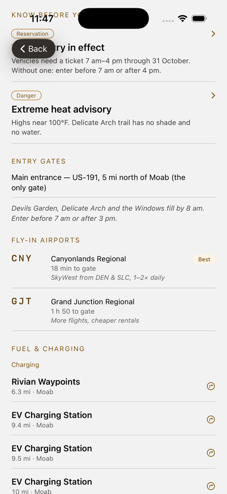

**Feedback:**
-

### **K2 — Park · Weather**

Today at the park, from the National Weather Service and Open-Meteo. ⚠ WeatherKit sits in
front of both and is off until the developer account is paid.

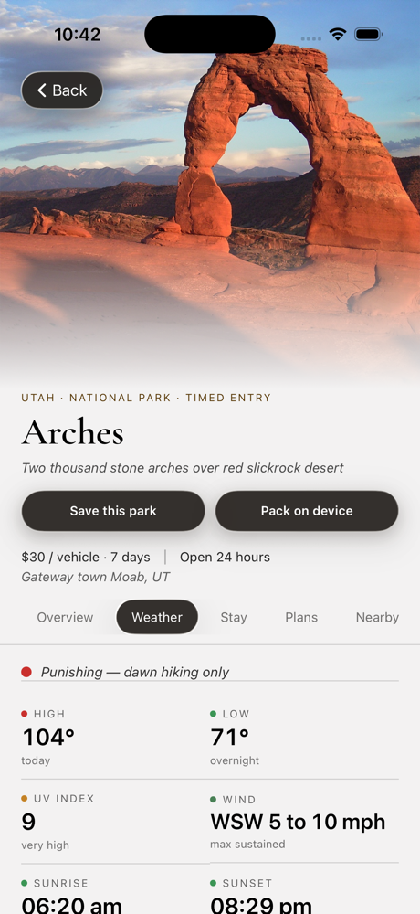

**Feedback:**
-

### **K2b — Park · Weather, lower**


**Feedback:**
-

### **K3 — Park · Stay**

In-park campgrounds and lodges. ⚠ Curated for the eight.


**Feedback:**
-

### **K3b — Park · Stay, lower**

Campgrounds, RV parks, beds and food around the park, live from Apple Maps.

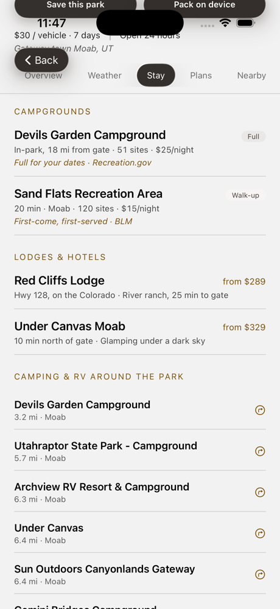

**Feedback:**
-

### **K4 — Park · Plans**

Day plans written around the light and the crowds. ⚠ Curated.


**Feedback:**
-

### **K4b — Park · Plans, lower**


**Feedback:**
-

### **K5 — Park · Nearby**

Passport units within reach. ⚠ Curated.

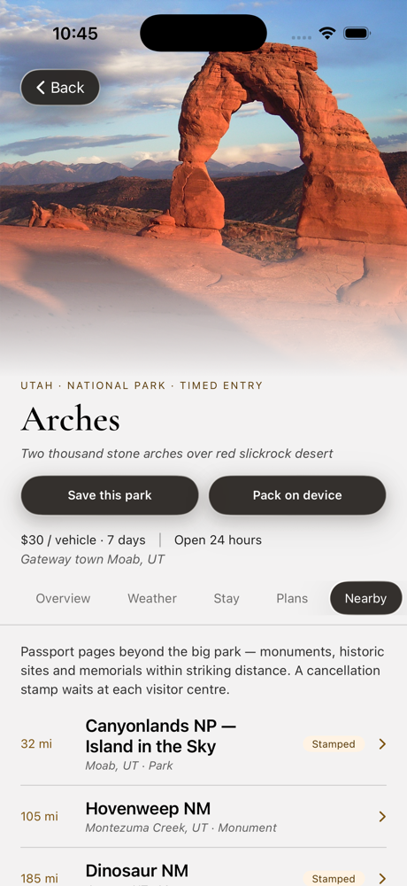

**Feedback:**
-

### **K6 — Park · from the live catalogue**

Guadalupe Mountains, opened from the on-device list. Every field the source does not
publish says so, and a heading with nothing under it is not drawn at all — which is why
this one opens on its chargers.

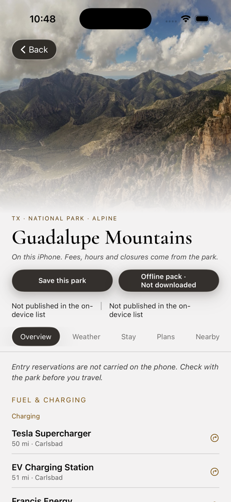

**Feedback:**
-

---

## Saved

### **S1 — Saved**

Bookmarked parks and the passport book.

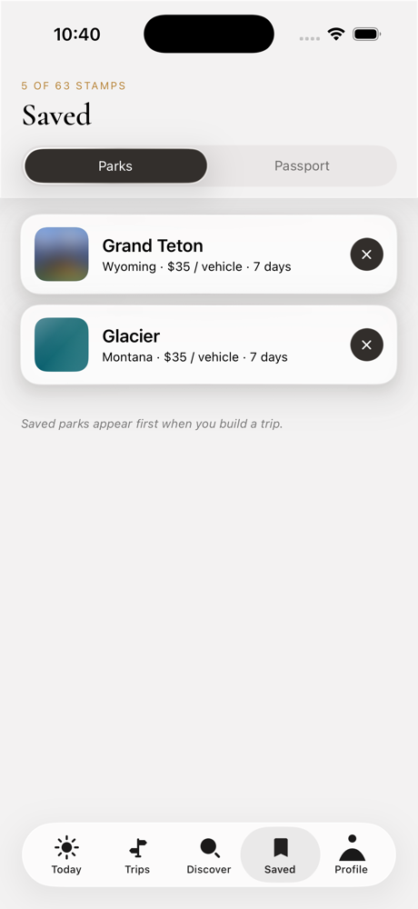

**Feedback:**
-

### **S1b — Saved, lower**


**Feedback:**
-

### **S1e — Saved, empty**

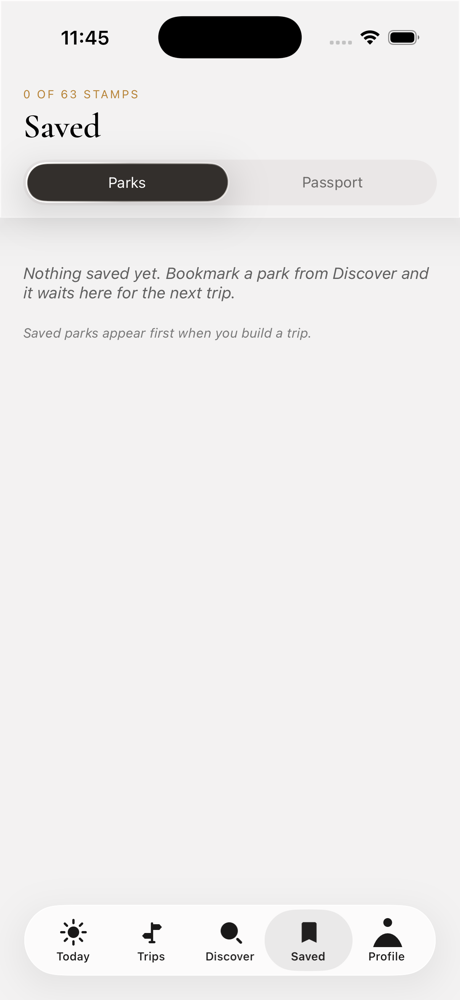

**Feedback:**
-

---

## Profile

### **P1 — Profile**

Notifications, offline packs, travel defaults.

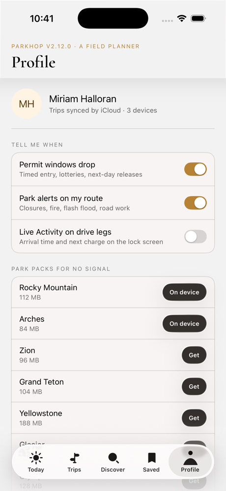

**Feedback:**
-

### **P1b — Profile, lower**

Travel defaults, what the app is holding, and the disclaimers. The photograph figure is
measured off the disk; ⚠ the pack figure is still the curated library's.


**Feedback:**
-

---

## Sheets

### **X1 — Sheet · park alert**


**Feedback:**
-

### **X2 — Sheet · permit window**

⚠ The countdown is a fixed string, not a clock.

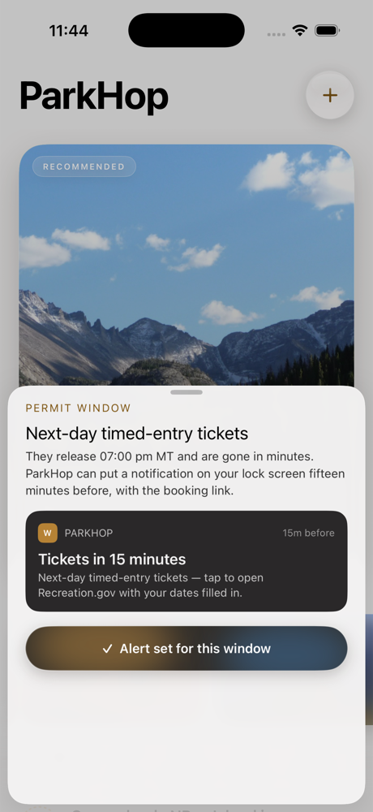

**Feedback:**
-

### **X3 — Sheet · driving leg**

⚠ This is the seed trip's leg sheet; a routed leg opens a different one, with Open in
Maps and no invented arrival time.

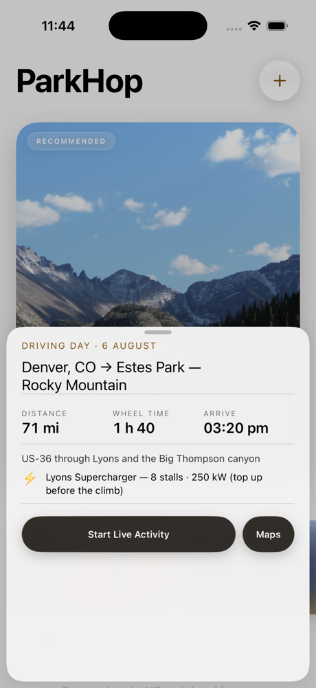

**Feedback:**
-

### **X4 — Sheet · passport stamp**


**Feedback:**
-

---

## How these were captured

Taps cannot be synthesised on this simulator, so every screen and state is reachable by
launching straight into it. These arguments change nothing about a normal launch.

```
xcrun simctl launch --terminate-running-process <device> us.parkhop.waypost <args>

-wpTab today|trips|discover|saved|me      a tab
-wpPark <code>  -wpSeg overview|weather|stay|plan|near
-wpTrip <id>    -wpTripSeg route|days|stays
-wpSearch <term>            Discover, field focused and searched
-wpStateParks 1             Discover, state-park side
-wpBuilder 1|2|3            the new-trip sheet at a step
-wpSheet alert|permit|leg|stamp
-wpEmpty trips|saved        that screen with nothing in it
-wpScroll bottom            start the screen at its end
```

Still not captured, and both are motion rather than a screen: the zoom transition between
a card and the park screen it opens, and the toast that confirms an action.
